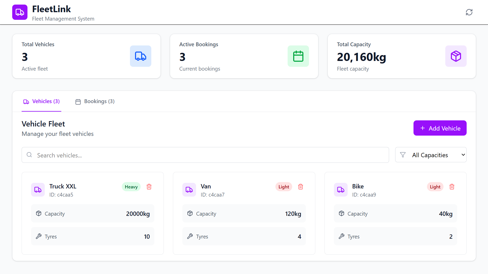

# FleetLink - Complete Full-Stack Fleet Management System

## 🎉 Application Overview

FleetLink is a modern, full-stack fleet management system built with Node.js, Express, MongoDB, React, and Tailwind CSS. It provides comprehensive vehicle and booking management with real-time availability checking and intelligent conflict detection.

## 🎥 Live Demo

[](https://drive.google.com/file/d/1lz86dKmbQ3ebtYBwrgeJjRy7JL2ZeYTE/view?usp=sharing/view)

## 🚀 Features

### Backend (Node.js + Express + MongoDB)

-   **RESTful API** with comprehensive CRUD operations
-   **Vehicle Management** with capacity and specification tracking
-   **Intelligent Booking System** with conflict detection
-   **Smart Availability Checking** based on routes and time
-   **Automatic Ride Duration Calculation** using pincode difference formula
-   **Comprehensive Test Suite** with 12 passing tests
-   **ES Modules** support for modern JavaScript
-   **Database Optimization** with compound indexes

### Frontend (React + Tailwind CSS)

-   **Modern Dashboard** with real-time statistics and tabbed navigation
-   **Organized Component Architecture** with feature-based folder structure
-   **Reusable Card Components** for consistent vehicle and booking displays
-   **Responsive Design** for all device sizes with mobile-first approach
-   **Interactive Forms** with real-time validation and debounced API calls
-   **Advanced Search and Filtering** with live status updates
-   **Real-time API Integration** with comprehensive error handling
-   **Beautiful UI** with Lucide React icons and smooth animations
-   **Loading States** and error boundaries for robust user experience
-   **Auto-refresh Functionality** for booking status transitions

## 🏗️ Architecture

```
FleetLink/
├── backend/          # 🔧 Node.js Backend
│   ├── models/                 # 📊 MongoDB Schemas
│   │   ├── Vehicle.js          # Vehicle model with capacity & specs
│   │   └── Booking.js          # Booking model with vehicle references
│   ├── controllers/            # 🧠 Business Logic Layer
│   │   ├── vehicleController.js # Vehicle CRUD + availability logic
│   │   └── bookingController.js # Booking CRUD + conflict detection
│   ├── routes/                 # 🛣️ API Route Definitions
│   │   ├── vehicles.js         # Vehicle API endpoints
│   │   └── bookings.js         # Booking API endpoints
│   ├── tests/                  # 🧪 Test Suite (12 tests)
│   │   ├── vehicle.test.js     # Vehicle API & logic tests
│   │   └── booking.test.js     # Booking API & conflict tests
│   ├── config/                 # ⚙️ Configuration Files
│   │   └── db.js              # MongoDB connection setup
│   ├── .env / .env.test       # 🔐 Environment configurations
│   └── app.js                 # 🚀 Express app entry point
│
└── client/         # 🎨 React Frontend
    ├── src/
    │   ├── components/         # 🧩 Component Architecture
    │   │   ├── common/         # 🔧 Shared Components
    │   │   │   ├── DateTimePicker.jsx # Custom date/time input
    │   │   │   ├── DeleteModal.jsx    # Reusable confirmation modal
    │   │   │   ├── EditVehicleModal.jsx # Vehicle editing interface
    │   │   │   ├── ErrorBoundary.jsx  # Error handling wrapper
    │   │   │   ├── LoadingSpinner.jsx # Loading state indicator
    │   │   │   └── NotificationContainer.jsx # Toast system
    │   │   ├── vehicles/       # 🚚 Vehicle Feature Module
    │   │   │   ├── VehicleCard.jsx    # Individual vehicle display
    │   │   │   ├── VehicleForm.jsx    # Vehicle creation/edit form
    │   │   │   └── VehicleList.jsx    # Vehicle grid + search/filter
    │   │   └── bookings/       # 📅 Booking Feature Module
    │   │       ├── BookingCard.jsx    # Individual booking display
    │   │       ├── BookingForm.jsx    # Booking creation form
    │   │       └── BookingList.jsx    # Booking list + filter/search
    │   ├── services/           # 🌐 API Layer
    │   │   └── api.js         # Axios config + endpoint definitions
    │   ├── assets/            # 📷 Static Resources
    │   ├── App.jsx            # 🏠 Main app with dashboard & routing
    │   ├── main.jsx           # 🚀 Entry point with providers
    │   └── index.css          # 🎨 Global styles & Tailwind imports
    ├── public/                # 📁 Static Assets
    ├── package.json           # 📦 Dependencies & scripts
    ├── vite.config.js         # ⚡ Vite build configuration
    └── tailwind.config.js     # 🎨 Tailwind CSS configuration
```

## 🔧 Technical Stack

### Backend

-   **Node.js 18+** - Runtime environment
-   **Express.js 4.18** - Web framework
-   **MongoDB + Mongoose 7.0** - Database and ODM
-   **Jest + Supertest** - Testing framework
-   **dotenv** - Environment configuration
-   **cors + morgan** - Middleware

### Frontend

-   **React 19** - UI library
-   **Vite 7** - Build tool and dev server
-   **Tailwind CSS 4** - Utility-first CSS framework
-   **Axios** - HTTP client
-   **Lucide React** - Icon library
-   **date-fns** - Date manipulation

## 🚀 Quick Start

### Prerequisites

-   Node.js 18+
-   MongoDB (local or cloud)
-   Git

### Installation

1. **Clone and setup backend:**

    ```bash
    cd backend
    npm install

    # Create environment files
    echo "MONGO_URI=mongodb://localhost:27017/fleetlink" > .env
    echo "MONGO_URI=mongodb://localhost:27017/fleetlink_test" > .env.test

    # Run tests
    npm test

    # Start server
    npm start
    ```

2. **Setup frontend:**

    ```bash
    cd ../client
    npm install

    # Start development server
    npm run dev
    ```

3. **Access the application:**
    - Frontend: http://localhost:5173
    - Backend API: http://localhost:5000/api

## 🧪 Testing

### Backend Tests

All 12 tests passing:

-   ✅ Vehicle CRUD operations
-   ✅ Vehicle availability checking with capacity filtering
-   ✅ Booking conflict detection
-   ✅ Ride duration calculation
-   ✅ Error handling and validation

```bash
cd backend
npm test
```

## 📡 API Endpoints

### Vehicles

-   `GET /api/vehicles` - Get all vehicles
-   `POST /api/vehicles` - Create vehicle
-   `GET /api/vehicles/available` - Get available vehicles with conflict checking

### Bookings

-   `GET /api/bookings` - Get all bookings (with populated vehicle data)
-   `POST /api/bookings` - Create booking with conflict detection
-   `DELETE /api/bookings/:id` - Delete booking

## ✨ Key Features

### 🚚 **Vehicle Management**
- **CRUD Operations**: Full Create, Read, Update, Delete functionality
- **Smart Search**: Real-time search by brand, model, or type
- **Filter System**: Multi-criteria filtering (type, capacity, availability)
- **Availability Tracking**: Real-time status updates with automatic conflict detection
- **Capacity Management**: Dynamic load calculation and optimization

### 📅 **Booking System**
- **Intelligent Scheduling**: Date/time picker with conflict prevention
- **Status Tracking**: Real-time status updates (Upcoming → Active → Completed)
- **Route Planning**: From/To pincode validation and route optimization
- **Auto-Refresh**: Live status updates every 60 seconds
- **Conflict Detection**: Prevents double-booking of vehicles

### � **User Experience**
- **Responsive Design**: Mobile-first approach with Tailwind CSS
- **Real-time Updates**: Live data synchronization across all components
- **Error Handling**: Comprehensive error boundaries and user feedback
- **Loading States**: Smooth loading indicators and skeleton screens
- **Toast Notifications**: Non-intrusive success/error messaging

### ⚡ **Performance Optimizations**
- **Debounced API Calls**: 500ms debouncing for form inputs
- **Lazy Loading**: Component-based code splitting
- **Efficient Rendering**: React 19 optimizations and memo usage
- **Database Indexing**: Optimized MongoDB queries with proper indexes

### 🧪 **Testing & Quality**
- **Test Coverage**: 12 comprehensive test cases
- **API Testing**: Full endpoint validation with edge cases
- **Error Scenarios**: Robust error handling and validation
- **Code Quality**: ESLint configuration with modern standards

## ✨ Key Features

### 1. Smart Availability System

-   Real-time availability checking
-   Considers existing bookings and time conflicts
-   Capacity-based filtering
-   Route-aware duration calculation

### 2. Intelligent Conflict Detection

-   Overlapping time slot detection
-   Vehicle-specific booking validation
-   Automatic ride duration calculation: `Math.abs(parseInt(toPincode) - parseInt(fromPincode)) % 24`

### 3. Modern User Interface

-   Responsive dashboard with real-time statistics
-   Organized component architecture with feature-based folders
-   Reusable card components for consistent design
-   Real-time search and filtering with status-based filtering
-   Interactive forms with validation and debounced API calls
-   Auto-refresh booking status transitions (Upcoming → Active)
-   Beautiful animations and transitions with hover effects
-   Mobile-first responsive design

### 4. Robust Error Handling

-   Comprehensive validation with field-level error feedback
-   User-friendly error messages with contextual information
-   Graceful error boundaries with fallback UI
-   API error interception with retry mechanisms
-   Debounced API calls to prevent excessive requests
-   Optimistic UI updates with rollback on failure

## 🔄 Workflow

1. **Add Vehicles**: Start by adding vehicles to your fleet
2. **Create Bookings**: Book vehicles for specific routes and times
3. **Monitor Availability**: System automatically prevents conflicts
4. **Manage Fleet**: View, search, and filter your vehicles and bookings

## 🌟 Advanced Features

### Component Architecture

-   **Feature-based organization** - Components grouped by functionality (vehicles/, bookings/, common/)
-   **Reusable card components** - Consistent VehicleCard and BookingCard components
-   **Shared common components** - DateTimePicker, DeleteModal, ErrorBoundary, LoadingSpinner
-   **Separation of concerns** - Clear distinction between UI, business logic, and API layers

### Real-time Updates

-   **Auto-refresh booking status** - Bookings automatically transition from "Upcoming" to "Active"
-   **Debounced API calls** - Prevents excessive requests during user input
-   **Optimistic UI updates** - Immediate feedback with rollback on errors
-   **Live availability status** - Real-time conflict detection and vehicle availability

### User Experience Enhancements

-   **Smart filtering** - Status-based filtering (All, Active, Upcoming bookings)
-   **Search capabilities** - Search across multiple fields (customer, vehicle, pincode)
-   **Loading states** - Skeleton loading and spinners for better perceived performance
-   **Error feedback** - Toast notifications and inline error messages
-   **Responsive design** - Mobile-first approach with touch-friendly interactions

### Database Optimization

-   Compound indexes for efficient queries
-   Optimized availability checking with populated vehicle data
-   Proper data relationships and referential integrity

### Production Ready

-   Environment-specific configurations
-   Comprehensive error handling at all levels
-   Performance optimizations with debouncing
-   Security best practices with input validation

## 🚀 Deployment

### Backend

```bash
npm run build  # If using TypeScript
npm start
```

### Frontend

```bash
npm run build
npm run preview
```

## 📝 Development Notes

-   Backend runs on port 5000 with comprehensive API endpoints
-   Frontend runs on port 5173 with hot reload for development
-   Tests use in-memory/test database for isolated testing
-   All components are fully responsive with mobile-first design
-   Error boundaries handle runtime errors gracefully
-   API calls include proper error handling with user feedback
-   Component architecture follows feature-based organization
-   Debounced API calls prevent excessive server requests
-   Auto-refresh functionality keeps booking status current
-   Reusable card components ensure consistent UI patterns

## 🤝 Contributing

1. Follow existing code patterns and component organization
2. Add tests for new features and maintain test coverage
3. Ensure responsive design across all device sizes
4. Handle error states properly with user-friendly messages
5. Update documentation for new features or architectural changes
6. Use feature-based folder structure for new components
7. Implement proper loading states and optimistic updates
8. Follow accessibility guidelines for inclusive design

---

**FleetLink** - Modern Fleet Management Made Simple 🚛✨
